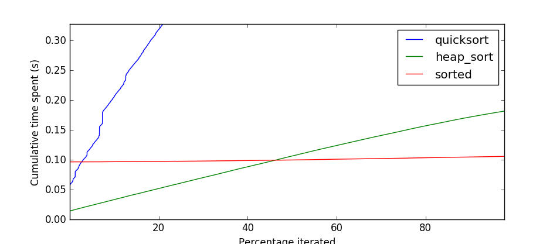

Lazy sorting in python
======================

A common need when working with data, is to find the top 10 in a larger list. An easy solution is to use the built-in sort function to sort the entire list, and then just take the first 10 items. While this works, it feels wasteful. Other than knowing what _is_ the tail, you're not interested in the tail of the list at all.

January 2017, Bora M. Alper [posted](https://www.reddit.com/r/Python/comments/5mpmj8) his [take](https://github.com/boramalper/lazysort) on this problem: `lazysort`. Using python generators, he sorted the list using dropsort as needed, returning just the part of the list that was requested. While Bora's idea is quite neat, sadly his benchmark showed that it couldn't actually compete with using python's built-in sort function. This is not very surprising, cpython's `sorted` function uses the state-of-the-art TimSort algorithm, and it is implemented in optimized C.

But his approach gave me inspiration. While I feel dropsort is sort of a gimmick, Bora might actually be on to something here. During my time as a game developer, I built an early-out version of quicksort, which returned as soon as the head of the list was sorted. We should be able to build a something similar using python generators.

A generator-based quicksort could look like this:

```python
def partition(unsorted):
    sublist_length = len(unsorted)
    if sublist_length <= 1:
        return unsorted, ()

    pivot = unsorted[0]
    lhs = []
    rhs = []

    for idx in range(1, sublist_length):
        finger = unsorted[idx]
        if finger < pivot:
            lhs.append(finger)
        else:
            rhs.append(finger)

    lhs.append(pivot)
    return lhs, pivot, rhs


def quicksort(unsorted):
    if len(unsorted) < 2:
        yield from unsorted
    else:
        lhs, rhs = partition(unsorted)
        yield from quicksort(lhs)
        del lhs  # release memory used by lhs
        yield pivot
        yield from quicksort(rhs)
```

For the uninitiated: quicksort works by splitting lists in two parts: one list with all items smaller than some pivot value, one with all items larger than that pivot value, and then repeating that procedure on both lists. Splitting the lists is the task of the partition function. 

When comparing my implementation to lazy sort and the built-in `sorted` function, you can clearly see that while Bora's `lazysort` can't compete, his idea is sound. (This benchmark was based on retrieving the top 10 from a list of integers).

<a href="images/sort_results1.png" title="Finding top 10 in a list of integers" width="200" height="150"></a>

The chart is dominated by `lazysort`, obscuring the fact that partial quicksort is indeed faster than the built-in `sorted`.

**Update** [/u/imps-p0155](https://www.reddit.com/user/imps-p0155) mentioned in his [comment](https://www.reddit.com/r/Python/comments/5mqvqb/lazy_sorting_in_python/dc5pk6n/) that using `heapq.heapify` would provide even better performance. He's absolutely right:

<a href="images/sort_results2.png" title="Finding top 10 in a list of integers" width="200" height="150"></a>


Further Analysis
================

Now that we know we can beat `sorted`, let's see why this is. A lazy sorting algorithm only has benefit when it can decide not to do some work. In quicksort's case, not having to sort the right partition several times in a row is a huge benefit. But where's the cut-off when sorting items?

<a href="images/sort_results3.png" title="Finding top 10 in a list of integers" width="200" height="150"></a>

If you just need the first few percent, lazy `quicksort` can help out, but it has nothing on using `heapq`, which breaks even at ~45%, and has a worst case (100% iteration) premium of only 200% over `sorted`. **Conclusion**: while partial quicksort is an interesting gimmick, it has no added value over `heapq`.

Possible performance improvements
=================================

I'm doubtful optimization of `quicksort` will make it compete with `heapq`. Partial `quicksort`'s best case (only retrieving one item) still requires performing `log(n)` partitions; *O(n log(log(n))* performance, and it's worst case (retrieving all items) is still *O(n log(n))*. The `heapq` based solution has a generalized performance of *O(n + m log(n))*, which is always better than `quicksort`.

Possible feature improvements
=============================

Currently support for `sorted`'s `key` and `reverse` parameters is lacking, but those are trivial to add.

Lazy Quicksort could fake an list-like interface. The current implementation only sorts the head, but the principle applies to any part of the sorted list. This is something you can't achieve with heapq, which can only operate at the end of the lists. This could speed up computation of median values, and percentiles, although with my test data, it will probably only outperform `heapq` for the 45-55 percentile, which is a really narrow niche.
